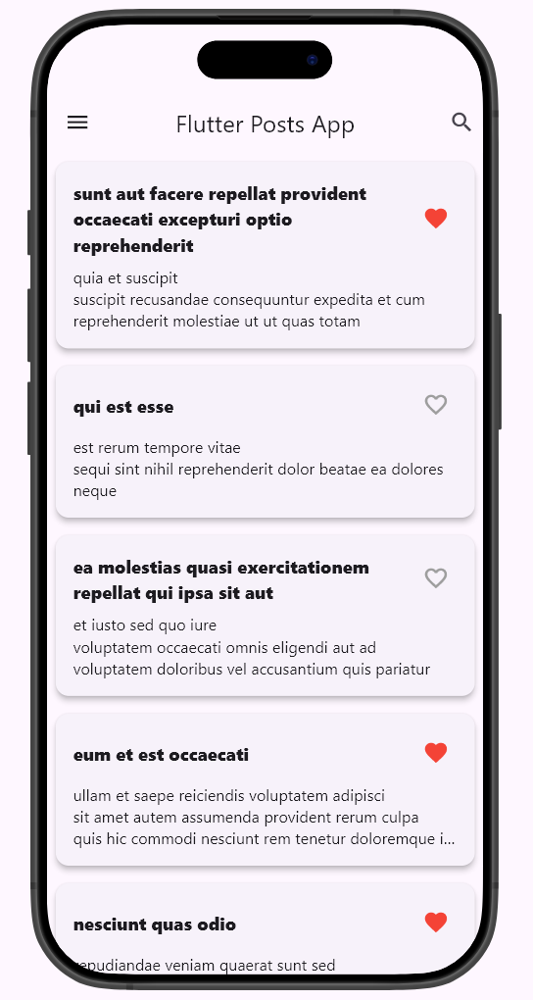
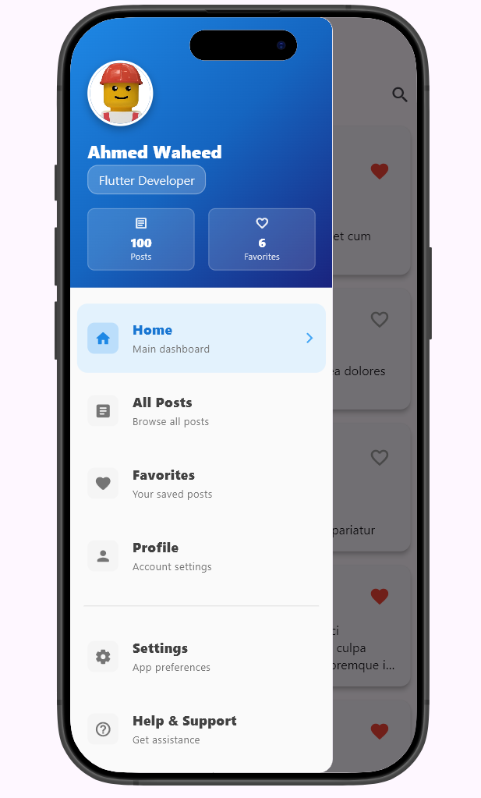
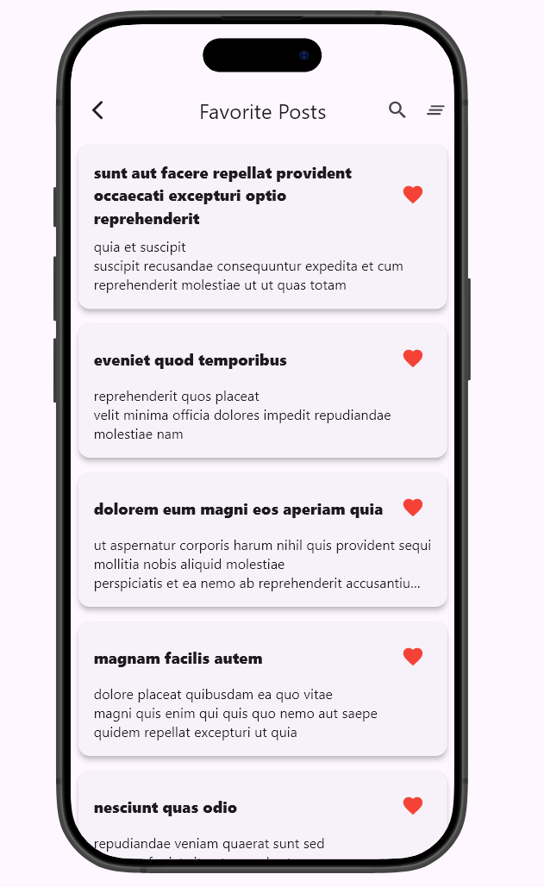
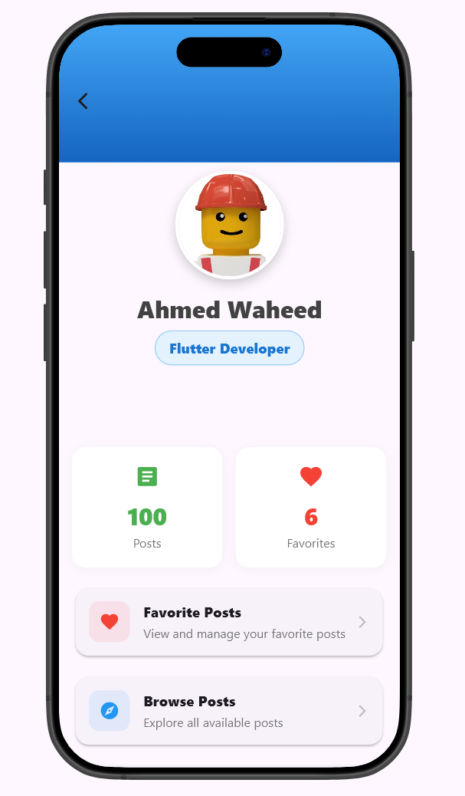

# Yalla Post 📱

A modern Flutter application demonstrating **MVVM (Model-View-ViewModel)** architecture with **Riverpod** state management. This app fetches posts from JSONPlaceholder API and allows users to manage their favorite posts with local persistence.

## 📸 App Preview

<div align="center">
  
  
  
  
</div>

_Beautiful Material Design 3 interface with MVVM architecture_

## ✨ Features

- 📑 **Browse Posts**: View posts fetched from JSONPlaceholder API
- ❤️ **Favorites Management**: Add/remove posts from favorites with local persistence
- 🔍 **Search Functionality**: Search through posts and favorites
- 👤 **User Profile**: View user statistics and manage profile
- 🎨 **Beautiful UI**: Modern Material Design 3 interface
- 📱 **Responsive Design**: Works across different screen sizes
- 🔄 **Pull to Refresh**: Refresh posts with pull-down gesture
- 💾 **Offline Storage**: Favorites persist using SharedPreferences
- 🎭 **Device Preview**: Test on different device sizes during development

## 🏗️ Architecture

This project follows **MVVM (Model-View-ViewModel)** architectural pattern:

```
lib/
├── models/              # Data models and entities
│   ├── post.dart        # Post model with JSON serialization
│   └── user.dart        # User profile model
├── services/            # Business logic and data operations
│   ├── post_service.dart     # API service for posts
│   └── favorite_service.dart # Local storage for favorites
├── viewmodels/          # State management and business logic
│   ├── posts_viewmodel.dart      # Posts state management
│   ├── favorites_viewmodel.dart  # Favorites state management
│   └── user_viewmodel.dart       # User profile management
├── views/               # UI components
│   ├── pages/          # Screen-level widgets
│   │   ├── home_page.dart
│   │   ├── posts_page.dart
│   │   ├── favorite_posts_page.dart
│   │   └── profile_page.dart
│   └── widgets/        # Reusable UI components
│       ├── post_card.dart
│       ├── animated_loader.dart
│       ├── app_drawer.dart
│       └── post_search_delegate.dart
├── app_exports.dart     # Barrel file for easy imports
└── main.dart           # Application entry point
```

## 🚀 Getting Started

### Prerequisites

- Flutter SDK (3.0.0 or higher)
- Dart SDK (3.0.0 or higher)
- Android Studio / VS Code
- Git

### Installation

1. **Clone the repository**

   ```bash
   git clone <repository-url>
   cd yalla_post
   ```

2. **Install dependencies**

   ```bash
   flutter pub get
   ```

3. **Run the application**
   ```bash
   flutter run
   ```

### Available Commands

```bash
# Clean project
flutter clean

# Get dependencies
flutter pub get

# Run app in debug mode
flutter run

# Run app in release mode
flutter run --release

# Build APK
flutter build apk

# Run tests
flutter test

# Analyze code
flutter analyze
```

## 📦 Dependencies

### Core Dependencies

- **flutter_riverpod**: State management solution
- **http**: HTTP client for API calls
- **shared_preferences**: Local data persistence
- **cached_network_image**: Efficient image loading and caching

### Development Dependencies

- **device_preview**: Test app on different device sizes
- **flutter_lints**: Linting rules for clean code

## 🎯 Key Features Explained

### State Management with Riverpod

- **Reactive UI**: Automatically rebuilds when state changes
- **Performance Optimized**: Only rebuilds affected widgets
- **Type Safe**: Compile-time type checking
- **Easy Testing**: Injectable and mockable providers

### Local Storage

- **Persistent Favorites**: Uses SharedPreferences to store favorites locally
- **Optimistic Updates**: Immediate UI feedback with rollback on errors
- **Cross-session Persistence**: Favorites survive app restarts

### API Integration

- **JSONPlaceholder API**: Fetches sample posts for demonstration
- **Error Handling**: Graceful error handling with user feedback
- **Loading States**: Clear loading indicators during data fetching

### User Experience

- **Pull-to-Refresh**: Natural gesture for content updates
- **Search**: Quick search through posts and favorites
- **Navigation**: Intuitive drawer navigation
- **Responsive Design**: Adapts to different screen sizes

## 📱 Screenshots

### Home Page

The main dashboard displaying all posts with beautiful Material Design 3 interface.


### Navigation Drawer

Elegant navigation drawer with user profile information and app statistics.


### Favorites Page

Manage your favorite posts with search functionality and clear all option.


### Profile Page

User profile with statistics, action cards, and beautiful gradient design.


### Key UI Features:

- **Home Page**: Main dashboard with posts list and search
- **Navigation Drawer**: User profile and app navigation
- **Favorites Page**: Manage favorite posts with enhanced UX
- **Profile Page**: User statistics and quick actions
- **Search**: Quick search through posts and favorites
- **Pull-to-Refresh**: Natural gesture for content updates

## 🏛️ Architecture Benefits

### ✅ Separation of Concerns

- **Models**: Pure data structures
- **Services**: Business logic and API calls
- **ViewModels**: State management
- **Views**: UI components only

### ✅ Testability

- Unit test ViewModels independently
- Mock services for testing
- Clear testing boundaries

### ✅ Maintainability

- Organized code structure
- Clear responsibilities
- Easy to locate and modify features

### ✅ Scalability

- Easy to add new features
- Consistent patterns
- Reusable components

## 🧪 Testing

```bash
# Run all tests
flutter test

# Run tests with coverage
flutter test --coverage

# Run specific test file
flutter test test/viewmodels/posts_viewmodel_test.dart
```

## 📖 Documentation

- **[MVVM_ARCHITECTURE.md](MVVM_ARCHITECTURE.md)**: Detailed architecture documentation
- **Code Comments**: Inline documentation throughout the codebase
- **Widget Documentation**: Each widget is properly documented

## 🤝 Contributing

1. Fork the repository
2. Create a feature branch (`git checkout -b feature/amazing-feature`)
3. Commit your changes (`git commit -m 'Add amazing feature'`)
4. Push to the branch (`git push origin feature/amazing-feature`)
5. Open a Pull Request

### Code Style

- Follow Flutter/Dart style guidelines
- Use meaningful variable and function names
- Add comments for complex logic
- Maintain MVVM architecture patterns

## 🔧 Development Setup

### VS Code Extensions (Recommended)

- Flutter
- Dart
- Flutter Riverpod Snippets
- Flutter Widget Snippets

### Android Studio Plugins

- Flutter
- Dart
- Riverpod Snippets

## 📈 Performance Considerations

- **Lazy Loading**: ViewModels created only when needed
- **Efficient Rebuilds**: Riverpod selectors for minimal updates
- **Image Caching**: Cached network images for better performance
- **Optimistic Updates**: Immediate UI feedback

## 🐛 Troubleshooting

### Common Issues

1. **Build Errors**: Run `flutter clean && flutter pub get`
2. **Dependency Conflicts**: Check `pubspec.yaml` versions
3. **State Not Updating**: Ensure proper Riverpod provider usage
4. **Network Issues**: Check internet connection and API availability

## 📄 License

This project is open source and available under the [MIT License](LICENSE).

## 🙏 Acknowledgments

- [JSONPlaceholder](https://jsonplaceholder.typicode.com/) for the demo API
- [Flutter](https://flutter.dev/) for the amazing framework
- [Riverpod](https://riverpod.dev/) for excellent state management
- Flutter community for inspiration and best practices

## 📞 Support

If you have any questions or need help with the project, please:

1. Check the [MVVM_ARCHITECTURE.md](MVVM_ARCHITECTURE.md) documentation
2. Search existing issues
3. Create a new issue with detailed information

---

**Happy Coding! 🚀**
